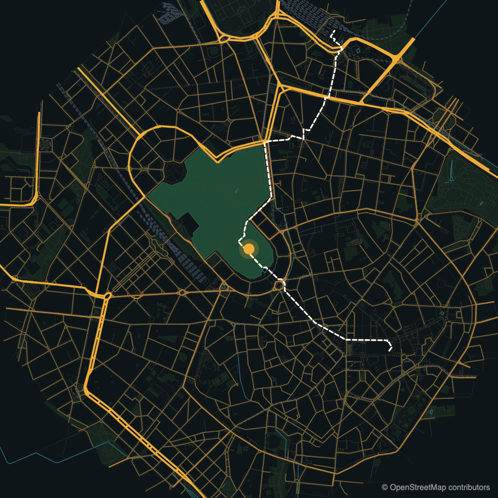

# osm-walkmap

A real OpenStreetMap map, redrawn in your own style, with the walking routes actually computed.



You give it a point and a few destinations. It gives you a layered SVG you can style with CSS and animate with `stroke-dashoffset`, plus a JSON with the distance and the walking minutes to each destination, measured on the real pedestrian network.

**Standard library only.** No pip install, no geospatial stack, no API key. One file, ~250 lines.

```bash
export OSM_CONTACT="you@example.com"          # the Overpass usage policy asks clients to identify themselves
python3 osm_walkmap.py --lat 45.4706 --lon 9.1795 --radius 1800 --tol 8 --out example \
  --target "Duomo=45.4641,9.1919" \
  --target "Porta Garibaldi station=45.4848,9.1876:bike" \
  --target-boundary "Parco Sempione=leisure=park" --area-full "Parco Sempione"
```

```
INFO walk graph: 42400 nodes, house snapped to node at 22 m
INFO bike graph: 42546 nodes, house snapped to node at 22 m
INFO map.svg 560 KB, layers {'green': 767, 'green-hero': 1, 'road-major': 430, 'path': 10064, ...}
INFO Duomo                   1483 m  20 min by walk
INFO Porta Garibaldi station 2213 m  11 min by bike
INFO Parco Sempione           155 m   3 min by walk
```

## Why this exists

It was written to open a property video: a still frame of the house that freezes, shrinks into a pin, and lands on the map of the town while three walking routes draw themselves, one per destination, with the minutes next to them. Every other tool either draws a beautiful map you cannot animate piece by piece, or computes routes without drawing anything, or pulls in half of the geospatial ecosystem to do both.

The point is honesty as much as looks. If a graphic tells a buyer "the school is six minutes away", that number should come from the street network, not from a designer's guess. This computes it, and refuses to invent one when the pedestrian graph cannot reach the destination.

## What you get

**`map.svg`** with a `viewBox` in metres, origin on your point, `x` east and `y` south. One group per feature class, so you can style and reveal them independently:

```
field · green · green-hero · water · rail · road-service · path · road-minor · road-mid · road-major
routes → <path id="route-0">, <path id="route-1">, …
```

Because the coordinate system is metres, placing a label is arithmetic, not guesswork: a destination at `(172, 98)` in `map.json` is 172 m east and 98 m south of your point.

**`map.json`**:

```json
{
  "house": {"lat": 45.61341, "lon": 9.267219, "snap_m": 2},
  "routes": [{"label": "Primary school", "mode": "walk", "reachable": true, "metres": 442, "minutes": 6,
              "point": [172.1, 97.9], "path_points": 6}],
  "attribution": "© OpenStreetMap contributors (ODbL)"
}
```

The `example/` folder holds the output of the command above, run from the Sforza Castle in Milan. A dense city centre is the worst case for size: ten thousand footpaths make a 560 KB SVG even at `--tol 8`. A town is closer to 100 KB.

**`overpass.json`** is the cached raw response. Re-running is free and does not hit the API again; delete it to refresh.

## Animating it

The routes are plain paths, so the classic line-drawing trick works:

```js
const path = document.querySelector("#route-0");
const len = path.getTotalLength();
path.style.strokeDasharray = len;
path.style.strokeDashoffset = len;
gsap.to(path, {strokeDashoffset: 0, duration: 1.2, ease: "power1.inOut"});
```

One warning learned the hard way: if your stylesheet sets `stroke-dasharray` with `!important`, it beats the inline value and every route appears fully drawn from frame zero.

## Options

| Option | |
|---|---|
| `--lat --lon` | the point everything is measured from. Required |
| `--radius` | metres of map to download around it (default 1800) |
| `--out` | output directory |
| `--target "Label=lat,lon"` | a destination. Repeatable. Append `:bike` to route it by bicycle |
| `--target-boundary "Label=key=value"` | a destination that is an **area**: the route ends at the nearest reachable point of its boundary, not its centroid. For a large park that is the difference between an honest number and a misleading one |
| `--area-full "Exact name"` | fetch that area whole even if it extends past the radius, so a big park is not drawn as clipped shards. It also gets its own `green-hero` layer |
| `--tol` | simplification tolerance in metres (default 4). This is what keeps the SVG around 100 KB instead of 2 MB |
| `--speed "walk=4.5,bike=15"` | speeds in km/h, if the defaults do not fit your audience |

Destinations are snapped to the nearest **reachable** node of the graph, not simply the nearest one: a clipped fragment at the edge of the download would otherwise make a perfectly walkable target look unreachable. If that snap is more than 150 m the tool warns you, because it usually means the target sits outside `--radius`.

Two modes, each with its own graph. **Walk** (4.5 km/h) uses everything but motorways and ways tagged `foot=no`. **Bike** (15 km/h) drops steps and footways unless they carry `bicycle=yes`, so a cycling route is not just the walking route at a higher speed: it can be longer and still faster. Minutes are rounded up.

## What it deliberately does not do

- **No isochrones.** Concentric "10 minutes" rings look precise and are not. Routes are.
- **No geocoding.** You pass coordinates you have verified. An address turned into a pin by a machine, unchecked, is exactly the kind of number that ends up wrong in front of an audience.
- **No OSRM demo server.** It returned 885 m for a 301 m walk in testing, with driving-shaped times.
- **No basemap tiles, no labels, no icons.** The styling is yours; this only hands you clean geometry.
- **When a destination is unreachable on the pedestrian graph it says so** and returns no route, rather than drawing a straight line and implying a path exists. Sidewalks are patchily mapped in small towns; that is a real outcome, not an error to paper over.

## Prior art

Every individual piece here is well covered by mature projects. The combination is the narrow gap this fills.

| Project | For | Dependencies | Routes and times | Layered SVG to animate |
|---|---|---|---|---|
| [OSMnx](https://github.com/gboeing/osmnx) | street network analysis and research | geopandas, networkx, shapely, matplotlib | yes, far more thorough than this | export, not per-feature groups |
| [prettymaps](https://github.com/marceloprates/prettymaps) | beautiful poster maps | osmnx, matplotlib, shapely, vsketch | no | not addressable per element |
| [Map Machine](https://github.com/enzet/map-machine) | full OSM renderer with an icon set | Cairo, GEOS | no | yes, but aimed at map display |
| [plotting-maps](https://github.com/piebro/plotting-maps) | pen plotter output | vpype | no | lines only |
| [pychrone](https://pypi.org/project/pychrone), [isolines](https://github.com/mlichter2/isolines) | isochrone polygons | osmnx stack | times, as polygons | no |
| [osm-router](https://github.com/jhole89/osm-router) | stdlib Dijkstra on OSM, as a demo | none | yes | no |
| **osm-walkmap** | one map for one graphic or video | **none** | yes, one path per route | yes, groups and metre coordinates |

If you need serious network analysis, use OSMnx. If you want a poster on your wall, use prettymaps. Use this when the map has to become a moving graphic and the minutes on screen have to be true.

## Licence and attribution

Code: [MIT](LICENSE), © 2026 Luca Cazzaniga. Written with AI assistance (Claude). The MIT licence covers this source code only, not the data you download with it, and not what you produce from that data: see [NOTICE](NOTICE).

Map data: © OpenStreetMap contributors, [ODbL](https://opendatacommons.org/licenses/odbl/). This is not optional and it does not stop at this repository: anything you publish that is derived from this output has to carry the attribution visibly. In a video, a line in a corner is enough. See the [OSM copyright page](https://www.openstreetmap.org/copyright).

Please also respect the [Overpass](https://dev.overpass-api.de/overpass-doc/en/preface/commons.html) and [Nominatim](https://operations.osmfoundation.org/policies/nominatim/) usage policies: set `OSM_CONTACT`, and let the cache do its job instead of re-querying in a loop.
